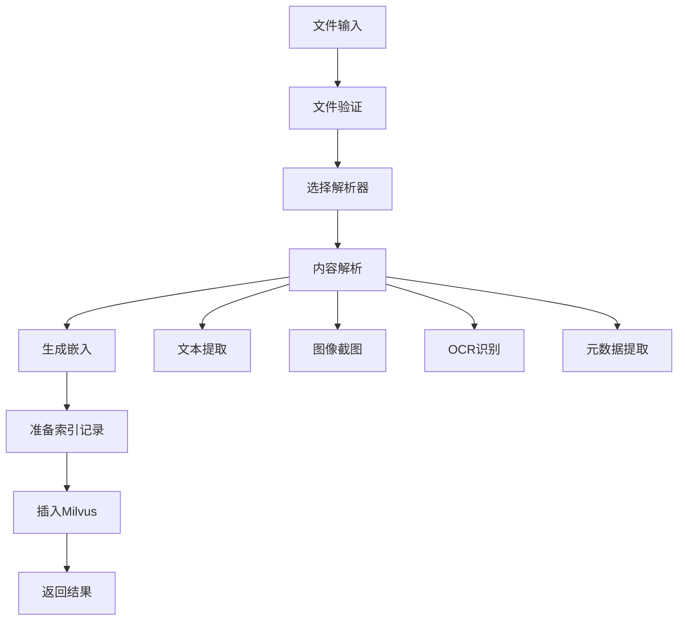
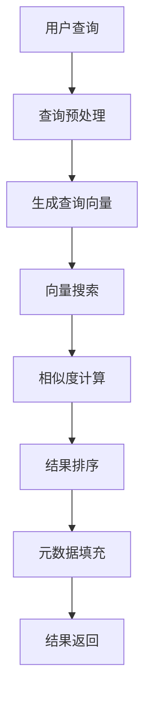

# 技术架构详解

## 系统架构概述

多模态文件索引器采用分层架构设计，从底层到顶层分为：数据存储层、索引管理层、文件处理层、解析器层、嵌入层和应用层。

## 核心组件详解

### 1. 数据存储层 (Storage Layer)

#### Milvus向量数据库
- **作用**: 存储向量嵌入和元数据
- **索引类型**: HNSW (Hierarchical Navigable Small World)
- **距离度量**: COSINE相似度
- **集合架构**: 支持多版本schema升级

#### 集合Schema设计
```python
# v4_high_quality schema
fields = [
    # 主键和基本信息
    FieldSchema(name="id", dtype=DataType.VARCHAR, max_length=100, is_primary=True),
    FieldSchema(name="file_path", dtype=DataType.VARCHAR, max_length=1000),
    FieldSchema(name="file_name", dtype=DataType.VARCHAR, max_length=255),
    FieldSchema(name="file_type", dtype=DataType.VARCHAR, max_length=50),
    
    # 内容信息
    FieldSchema(name="content_type", dtype=DataType.VARCHAR, max_length=50),
    FieldSchema(name="chunk_index", dtype=DataType.INT32),
    
    # chunk内容存储
    FieldSchema(name="chunk_content", dtype=DataType.VARCHAR, max_length=65535),
    FieldSchema(name="chunk_summary", dtype=DataType.VARCHAR, max_length=1000),
    FieldSchema(name="content_length", dtype=DataType.INT32),
    
    # 图像数据存储
    FieldSchema(name="image_data", dtype=DataType.VARCHAR, max_length=65535),
    FieldSchema(name="image_format", dtype=DataType.VARCHAR, max_length=20),
    FieldSchema(name="image_size", dtype=DataType.VARCHAR, max_length=50),
    FieldSchema(name="ocr_text", dtype=DataType.VARCHAR, max_length=10000),
    
    # 向量嵌入
    FieldSchema(name="vector", dtype=DataType.FLOAT_VECTOR, dim=1024),
    
    # 元数据
    FieldSchema(name="metadata", dtype=DataType.JSON),
    FieldSchema(name="file_metadata", dtype=DataType.JSON),
    FieldSchema(name="content_metadata", dtype=DataType.JSON),
    
    # 时间戳
    FieldSchema(name="created_at", dtype=DataType.INT64),
    FieldSchema(name="updated_at", dtype=DataType.INT64)
]
```

### 2. 索引管理层 (Index Management Layer)

#### IndexManager
- **职责**: 管理向量索引的CRUD操作
- **功能**: 
  - 向量搜索和相似度计算
  - 批量数据插入和删除
  - 索引性能优化
  - 健康检查和监控

#### CollectionManager
- **职责**: 管理Milvus集合的生命周期
- **功能**:
  - 集合创建、删除、升级
  - Schema版本管理
  - 索引创建和维护
  - 集合统计信息

### 3. 文件处理层 (File Processing Layer)

#### FileProcessor
- **核心流程**:
  1. 文件验证和类型检测
  2. 调用相应解析器解析内容
  3. 生成向量嵌入
  4. 准备索引记录
  5. 插入向量数据库

#### BatchProcessor
- **并发控制**: 使用asyncio.Semaphore控制并发数
- **进度跟踪**: 支持进度回调和状态监控
- **错误处理**: 异常隔离，单个文件失败不影响整体处理

### 4. 解析器层 (Parser Layer)

#### 解析器架构
```python
# 基础解析器接口
class BaseFileParser:
    def can_parse(self, file_path: str) -> bool
    def parse(self, file_path: str) -> ParsedContent
    def _validate_file(self, file_path: str)
    def _create_error_content(self, file_path: str, error: str)
```

#### 解析器注册表
```python
class FileParserRegistry:
    def __init__(self):
        self.parsers: List[BaseFileParser] = []
    
    def register_parser(self, parser: BaseFileParser)
    def get_parser(self, file_path: str) -> Optional[BaseFileParser]
    def list_parsers(self) -> List[str]
```

### 5. 嵌入层 (Embedding Layer)

#### VectorEmbedder
- **模型**: BAAI/bge-m3 (BGE-M3)
- **维度**: 1024维向量
- **特性**: 支持文本、图像、音频多模态嵌入
- **优化**: FP16精度，批量处理

#### 嵌入策略
```python
def embed_multimodal(self, content: ParsedContent) -> List[np.ndarray]:
    embeddings = []
    
    # 文本嵌入
    if content.text_content:
        text_embedding = self.embed_text(content.text_content)
        embeddings.append(text_embedding)
    
    # 图像嵌入
    if content.image_content:
        for image_data in content.image_content:
            image_embedding = self.embed_image(image_data)
            embeddings.append(image_embedding)
    
    # 音频嵌入
    if content.audio_content:
        audio_embedding = self.embed_audio(content.audio_content)
        embeddings.append(audio_embedding)
    
    return embeddings
```

### 6. 应用层 (Application Layer)

#### MultimodalIndexerSystem
- **系统管理**: 组件初始化、资源管理、生命周期控制
- **配置管理**: 统一配置加载和环境变量覆盖
- **错误处理**: 全局异常处理和资源清理

#### CLI接口
```bash
# 命令行工具
python -m multimodal_indexer.cli process-file <file_path>
python -m multimodal_indexer.cli process-directory <directory_path>
python -m multimodal_indexer.cli search <query>
python -m multimodal_indexer.cli health-check
```

#### Web界面
- **技术栈**: Flask + HTML/CSS/JavaScript
- **功能**: 文件上传、搜索、结果展示、图像预览
- **响应式设计**: 支持桌面和移动端

## 数据流程

### 文件处理流程


### 检索流程


## 性能优化

### 1. 向量索引优化
- **HNSW参数调优**: M=16, efConstruction=200
- **搜索参数**: ef=200 (搜索时动态调整)
- **批量操作**: 支持批量插入和搜索

### 2. 内存管理
- **流式处理**: 大文件分块处理，避免内存溢出
- **资源释放**: 及时释放PIL图像对象和临时文件
- **连接池**: Milvus连接复用

### 3. 并发控制
- **信号量控制**: 限制并发文件处理数量
- **异步处理**: 使用asyncio提高I/O密集型操作效率
- **错误隔离**: 单个任务失败不影响其他任务

### 4. 缓存策略
- **模型缓存**: BGE-M3模型一次加载，多次使用
- **集合缓存**: 缓存Collection对象，避免重复创建
- **配置缓存**: 配置对象单例模式

## 扩展性设计

### 1. 解析器扩展
- **插件化架构**: 新解析器只需继承BaseFileParser
- **自动注册**: 通过工厂模式自动注册新解析器
- **配置驱动**: 通过配置文件启用/禁用解析器

### 2. 嵌入模型扩展
- **模型抽象**: 支持切换不同的嵌入模型
- **API集成**: 支持OpenAI等云端嵌入服务
- **多模型融合**: 支持不同模态使用不同模型

### 3. 存储后端扩展
- **存储抽象**: 支持不同向量数据库后端
- **配置切换**: 通过配置文件切换存储后端
- **数据迁移**: 支持不同后端间的数据迁移

## 监控和运维

### 1. 日志系统
- **分级日志**: DEBUG/INFO/WARNING/ERROR
- **结构化日志**: JSON格式，便于分析
- **日志轮转**: 自动轮转和压缩

### 2. 健康检查
- **系统健康**: 检查各组件状态
- **数据库连接**: 检查Milvus连接状态
- **模型状态**: 检查嵌入模型加载状态

### 3. 性能监控
- **处理统计**: 文件处理成功率、耗时统计
- **搜索性能**: 查询响应时间、吞吐量
- **资源使用**: 内存、CPU、磁盘使用情况